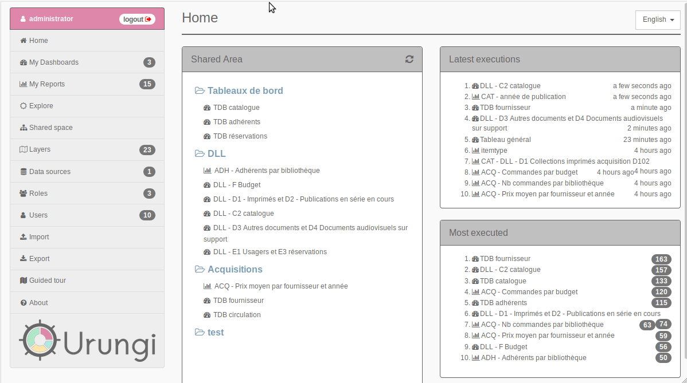

# Urungi

Lightweight open source software that allows you to create statistics and dashboards freely regardless of your data source. http://urungi.org

[](https://circleci.com/gh/biblibre/urungi)
[](https://lgtm.com/projects/g/biblibre/urungi/context:javascript)
[](https://codecov.io/gh/biblibre/urungi)

## Introduction

* Centralize:  Connect Urungi with any SQL data source. All your stats will end up in one place.
* Analyze: Explore and define your views and reports on your data according to your needs and the expectations of your users.
* Share: Create dashboards to visualize and display your data.
* Supported databases - PostgreSQL, MySQL, MS SQL Server, Oracle



## Requirements

- [nodejs](https://nodejs.org) (>= 12.x)
- [npm](https://www.npmjs.com)
- [MongoDB](https://www.mongodb.org) (>= 4.0)


## Installation

1. Install the requirements listed above
2. Clone the github repository

    ```
    git clone https://github.com/biblibre/urungi.git
    cd urungi
    ```

3. Download and install dependencies

    ```
    # In development environment
    npm ci
    
    # In production environment
    npm ci --only=production
    ```

4. Run MongoDB migrations

    ```
    # In development environment
    npx migrate-mongo up
    
    # In production environment
    NODE_ENV=production npx migrate-mongo up
    ```

5. (Optional but recommended) Create a local config file and change the
   session's secret (see [Configuration](#configuration))

## Configuration

Urungi uses [config](https://www.npmjs.com/package/config) to manage its
configuration files.

You can change the configuration by creating a file in `config/` directory named
`local-{env}.js` (where {env} is one of: `production`, `development`) and
overriding any properties defined in `config/default.js`

More info at https://github.com/lorenwest/node-config/wiki/Configuration-Files


## Oracle connections

If you are going to use oracle connections, Oracle Client libraries must be
installed. To get libraries, install an Instant Client Basic or Basic Light
package from
https://www.oracle.com/database/technologies/instant-client/downloads.html

Installation instructions: https://oracle.github.io/node-oracledb/INSTALL.html


## Starting up the Urungi server

1. Launch the server

    ```
    npm start
    ```

2. Point your browser to your ip/server name (eg. http://localhost:8080)
3. Enter the credentials

    - Username: `administrator`
    - Password: `urungi`

4. Enjoy!!!


## Upgrade

To upgrade Urungi to the latest version, follow these steps:

1. Update sources

    ```
    git pull --rebase
    ```

2. Update dependencies

    ```
    # In development environment
    npm ci
    
    # In production environment
    npm ci --only=production
    ```

3. Update database

    ```
    # In development environment
    npx migrate-mongo up
    
    # In production environment
    NODE_ENV=production npx migrate-mongo up
    ```

4. Restart the server


## Tests

See [testing](doc/development/testing.md)

## License

[GPL 3.0](https://opensource.org/licenses/GPL-3.0)
