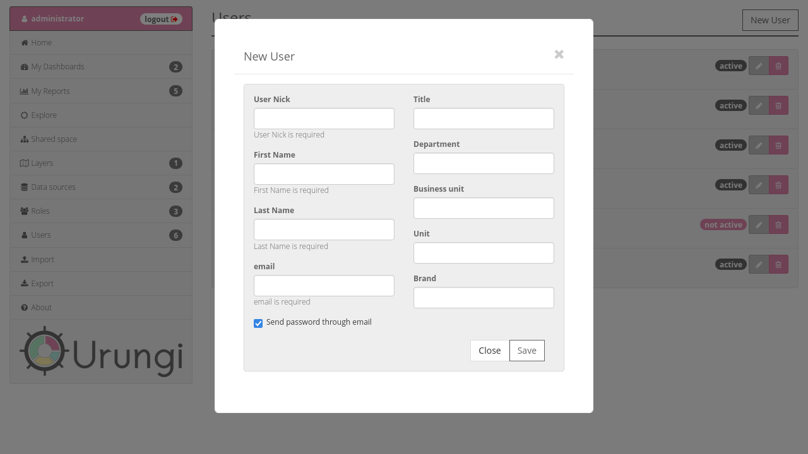

Create a new user
=================

To create a new user, go to the :doc:`Users <../users>` section, and click on
the ``New user`` button in the top right corner of the page.

This will open a modal window that let you fill all user informations.

Once you are done, click on the ``Save`` button. This will create the user and
close the modal window.
