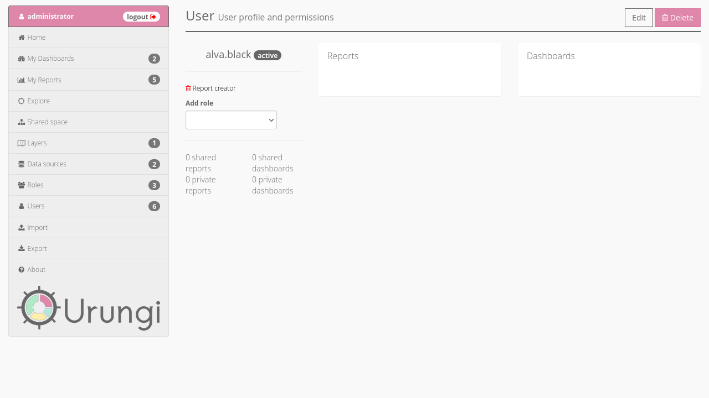

Modify an existing user
=======================

To modify an existing user go to the :doc:`Users <../users>` section, and click on
their name. This will bring you to the user's details page.

From there, you can:

* change user's status (active/inactive) by clicking on the status next to
  their username (inactive users cannot log in);
* grant user new permissions by adding a role, using the dropdown list;
* modify all other user's informations by clicking on the ``Edit`` button in
  the top right corner of the page;
* delete user by clicking on the ``Delete`` button in the top right corner of
  the page.
