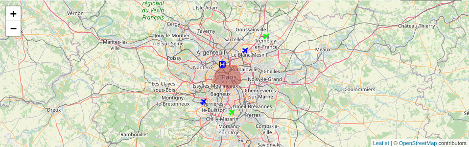
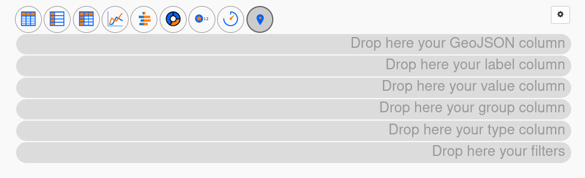
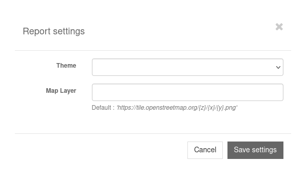
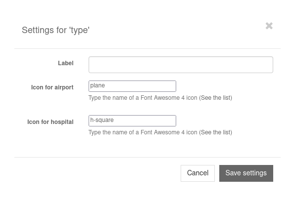

Map
===

The *map* report type allows to display `GeoJSON <https://geojson.org/>`_ objects on a map.

   Example of a map report

To use it, select the map marker icon.

   Screenshot of an empty map report

There are six different places where you can put your columns:

GeoJSON column
   This is the most important one. Place the column containing GeoJSON data here.

   If your database does not contain GeoJSON data, you can probably convert
   other formats to GeoJSON using SQL functions. For instance, MySQL has
   `ST_AsGeoJSON <https://dev.mysql.com/doc/refman/5.7/en/spatial-geojson-functions.html#function_st-asgeojson>`_
   (you may need to modify the layer to use those functions).

Label column
   If you drop a column here, its text content will be shown next to the map marker.

Value column
   If you drop a column here, its numeric content will be used to calculate a
   color intensity. Low values get low intensity and high values get high
   intensity.

Group column
   If you drop a column here, its content will be used to group markers
   together. If two rows have the same value in this column, they belong to the
   same group. Each group is then assigned a unique color hue for the map
   marker.

Type column
   If you drop a column here, its content will be used to assign a type to a
   row. Each type can then be associated with a specific icon to change the map
   marker appearance.

Filters
   These are regular filters and work the same as for other report types.

Report settings
---------------

   Screenshot of the map report settings modal window

In the report settings you can change the map layer. It's the map that will be
drawn under the GeoJSON objects. You can find different map layers on `the
OpenStreetMap Wiki <https://wiki.openstreetmap.org/wiki/Tile_servers>`_.

Configure icons
---------------

If you use a *type* column, you can associate an icon with each type. To do
that, click on the gear wheel icon next to the type column.

   Screenshot of the map type column settings modal window

Each distinct value contained in the type column will be displayed in the form.
Associate an icon with a type by entering the icon's name. Only
`Font Awesome 4 icons <https://fontawesome.com/v4.7/icons/>`_ are available at
the moment.
