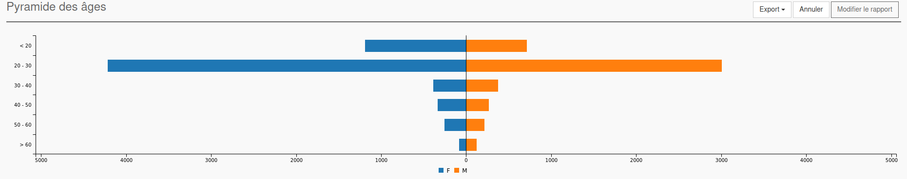
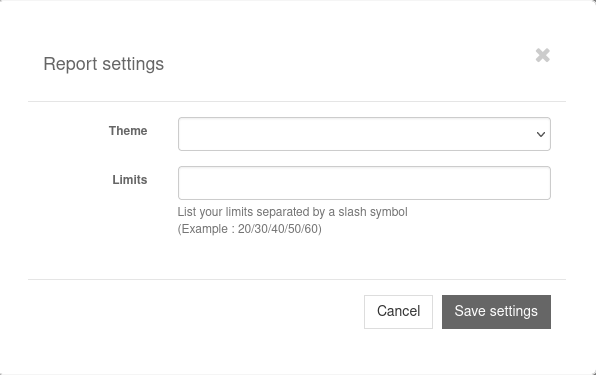

Population Pyramid
==================

The *population pyramid* report type allows to display a central graph like population pyramid.

   Example of a population pyramid report

There are three different places where you can put your columns:

Metrics
   This is the datas that will be analyzed and display in separated way.

Dimension column
   This is the column where you can put the field that will divide the results into different categories. 

Filters
   These are regular filters and work the same as for other report types.

Report settings
---------------

   Screenshot of the pyramid report settings modal window

Here you can easily indicate limits (range) for your datas separating by '/'.